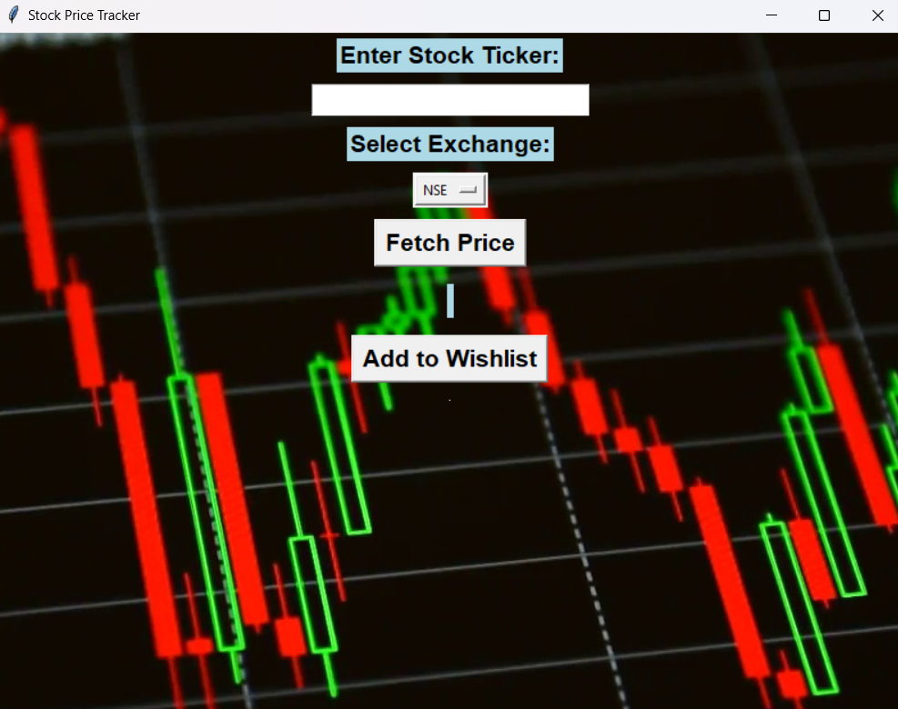

# Stock-Price-Tracker
# Real-Time Stock Price Tracker - User Manual

Track the stock prices of your favorite companies in real-time.

## Prerequisites

Before you begin, ensure that you have the following software and tools installed on your machine:

- **Python 3.x** - This project is developed using Python.
- **pip** - Python's package installer, required to install dependencies.
- **Internet Connection** - The tracker fetches real-time stock data via an API.
- **Code Editor** - Use any code editor like VS Code, PyCharm, Sublime Text, etc.

## Features

The Stock Price Tracker comes with the following key features:

- **Real-time stock price tracking**: Fetches and displays the latest stock prices every minute.
- **Multiple stock symbols**: Supports tracking for multiple companies such as AAPL (Apple), TSLA (Tesla), and more.
- **Terminal-based interface**: Easy to use and lightweight terminal-based interface for tracking stocks.
- **Automatic price updates**: Prices are automatically updated every minute, providing real-time data.
- **Cross-platform**: Works on all platforms (Windows, macOS, and Linux).
- **Simple to use**: Minimal configuration required, just install the dependencies and start tracking.

## Installation Steps

Follow these steps to install and set up the stock price tracker:

1. **Step 1:** Clone or download the repository to your local machine.

    ```bash
    git clone https://github.com/VARUNs2196/stock-price-tracker.git
    ```

2. **Step 2:** Navigate to the project directory in the terminal.

    ```bash
    cd stock-price-tracker
    ```

3. **Step 3:** Create a virtual environment (optional but recommended).

    ```bash
    python -m venv venv
    ```

4. **Step 4:** Activate the virtual environment.

    - On Linux/macOS:

    ```bash
    source venv/bin/activate
    ```

    - On Windows:

    ```bash
    venv\Scripts\activate
    ```

5. **Step 5:** Install the required dependencies using pip.

    ```bash
    pip install -r requirements.txt
    ```

## How to Use the Stock Price Tracker

Once everything is set up, follow these steps to use the tracker:

1. **Step 1:** Open a terminal window and run the Python script to start tracking stock prices.

    ```bash
    python track_stock.py
    ```

2. **Step 2:** The tracker will prompt you to enter a stock symbol (e.g., 'AAPL' for Apple, 'GOOG' for Google, 'TSLA' for Tesla).

3. **Step 3:** The tracker will fetch and display the real-time stock price for the symbol entered. Prices will be updated every minute.

4. **Step 4:** To stop the tracker at any time, press **Ctrl + C** in the terminal.

## Screenshot of Stock Price Tracker in Action
<div style="display: flex; justify-content: center; gap: 50px;">
    
    
</div>


## Troubleshooting

If you encounter any issues, here are some common solutions:

- **Problem:** "ModuleNotFoundError" or missing dependencies.  
  **Solution:** Make sure you have installed the necessary dependencies using `pip install -r requirements.txt`.

- **Problem:** "Invalid stock symbol" error.  
  **Solution:** Double-check that the stock symbol is correct. You can find valid stock symbols on stock market websites like Yahoo Finance or Google Finance.

- **Problem:** Stock price is not updating.  
  **Solution:** Ensure you have an active internet connection. The script requires internet access to fetch real-time data.

- **Problem:** The script crashes or doesn't run.  
  **Solution:** Check if all prerequisites are installed correctly, and ensure your Python version is up to date.

## Contact Support

If you need additional help, feel free to contact us:

- **Email:** [support@stocktracker.com](mailto:support@stocktracker.com)
- **GitHub Repository:** [https://github.com/VARUNs2196/stock-price-tracker](https://github.com/VARUNs2196/stock-price-tracker)

We will be happy to assist you with any questions or issues you may have!

---

&copy; 2024 Real-Time Stock Price Tracker | All Rights Reserved
